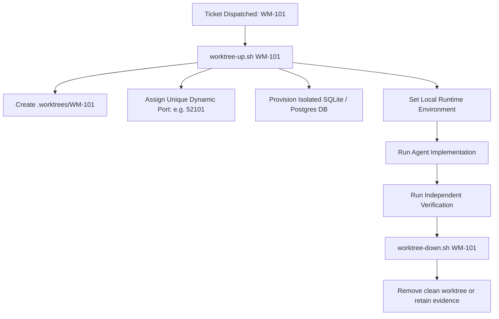

Git branches isolate code changes, but they do **not** isolate ports, databases, or daemon state. If two agents run tests against a shared development database or dev server port, they silently corrupt each other's work.

Factory mandates **one ticket, one worktree**.

## Worktree Lifecycle

Each dispatchable repository declares `worktree_up`, `worktree_down`, and `worktree_root` in `config/repos.yaml`:

```bash
bin/worktree-up.sh <TICKET-ID>      # spins up isolated environment
bin/worktree-down.sh <TICKET-ID>    # tears down and cleans up
```



## Safety Rules

:::caution[No Git Stash in Worktrees]
The `git stash` stack is repository-global, not isolated per worktree (`.git/refs/stash`). Running `git stash`, `git stash pop`, or `git rebase --autostash` can mix changes between concurrent sessions and cause data loss. Use a temporary commit or a namespaced patch file instead.
:::
