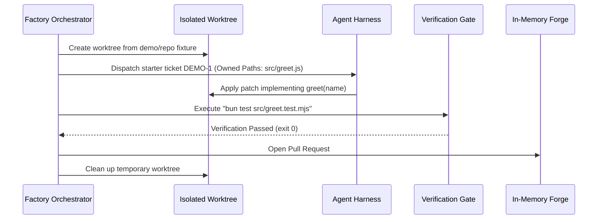

The fastest way to evaluate factory is the **offline demo**. It requires no Linear token, no GitHub token, and no model API key.

## Prerequisites

- [Bun](https://bun.sh) >= 1.3
- Git >= 2.40
- macOS 13+ or Linux (x64 / arm64)

## Running the Demo

```bash
git clone https://github.com/watt-mind/factory.git
cd factory
bun install
bin/factory demo --dry   # validate the plan offline (what CI runs)
bin/factory demo         # execute: claim → implement → verify → PR → merge
```

## What Happens Under the Hood



1. **Plan validation:** `--dry` inspects the starter ticket (`DEMO-1`), resolves `Owned Paths` and verification commands, and outputs the seven-step plan without executing.
2. **Worktree creation:** The runner copies `demo/repo/` into a temporary directory and runs that repository's `bin/worktree-up.sh`.
3. **Implementation:** Applies the bundled starter patch deterministically. `--harness claude` (or `codex`, `pi`, `gemini`, `cursor`, or `agy`) changes the adapter recorded on the demo ticket; the offline demo still invokes no model.
4. **Independent verification:** Runs `bun test src/greet.test.mjs` outside the agent process.
5. **PR and merge:** Opens and merges PR #1 against the in-memory forge, then marks `DEMO-1` Done without touching your Factory checkout.

:::tip[Ready for real repos?]
Continue to [First Real PR](/factory/getting-started/first-pr/) to point Factory at a real GitHub repository.
:::
